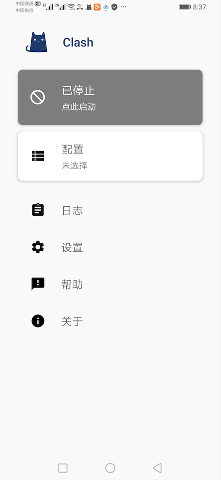
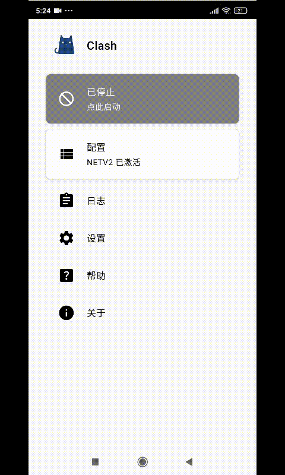
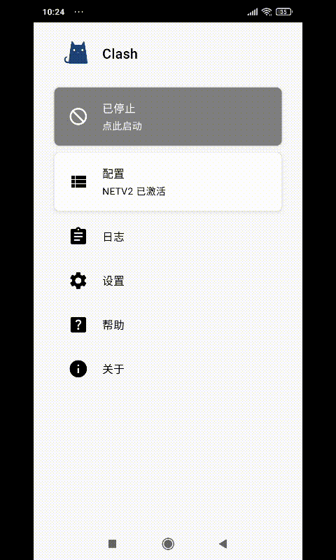

# 安卓Clash图文教程

## 软件下载地址

### 系统应为安卓7.0以上（版本1用不了请用版本2，如果安装有问题请联系客服解决）



[下载地址1](https://flie.netv2.top/s/v5gl7p)

[下载地址2](https://airnet.lanzoui.com/iAbHvq8jsub)



[下载地址1](https://flie.netv2.top/s/y4otw1)

[下载地址2](https://airnet.lanzoui.com/id9q6q8jsxe)



## Clash软件图文教程

### 1.主界面软件

### 2.导入订阅（分为一键导入和手动导入）



### 2.1.1 打开浏览器输入官网地址：[netv2.top](https://netv2.top) 点击一键订阅，导入到clash for Android。


注意：推荐使用自带浏览器，不要在QQ内，微信内，百度内打开否则无法跳转，





### 2.2.1 打开浏览器输入官网地址：[https://netv2.top](https://netv2.top) 登录后点击一键订阅，复制订阅地址 

### &#x20;

### 2.2.2 打开Clash软件主界面的配置→新配置→Url 来进入下面的界面，手动把订阅链接粘贴到URL里）




### 3.保存后，会自动返回到主界面，点击配置。选中刚刚导入的配置文件，然后点左上角按钮返回

### 4.这时主界面已经显示配置文件已激活，点击最上面的已停止按钮，启动后，会弹出代理选项，进入后可以看到服务器节点，(别用自动选择)

### 5.连接后，可以打开[www.YouTube.com](https://youtube.com)测试一下，如果油管可以打开就说明已经成功

### 6.如果需要选择模式，请在主界面点击 （设置），然后点击 （覆写），再点击 （模式）

.jpg>)

> 直连模式：全部国内国外走不走节点流量（相当于没开clash）
>
> 全局模式：全部国内国外都走节点流量（有可能导致访问国内比较卡）
>
> 规则模式：属于国内直连，国外自动走节点流量（建议使用）

### 7.手动更新，虽然设置了自动更新，也可以定期手动更新一下更稳妥

### 8.点击主界面的配置，配置文件右上角有三个点，呼出菜单

