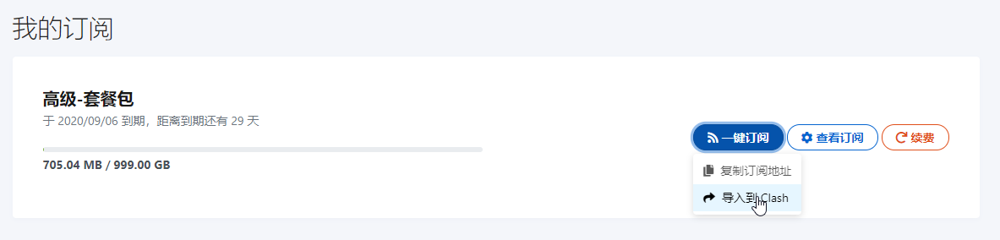

# 苹果电脑ClashX图文教程


先自行尝试安装使用，如果实在操作不了，请回到官网求助客服


### 软件下载

电脑系统应为macOS 10.13.0 及以上

> [下载地址1](https://cloud.abcabc.cyou/alibaba/Cross%20Firewalls/CLASH/ClashX%20\(pro\).dmg)
>
> [下载地址2](https://airnet.lanzoui.com/irt92q8ke8b)

### 图文教程

### 1. 软件安装

软件下载后，打开拖入应用程序文件夹，

### 2. 启动软件

在启动台内打开软件，软件会显示在电脑状态栏中


注意:如果是笔记本有可能状态栏图标显示满了，超出了范围，把状态栏空出来就看到了


.png>)

### 3. 导入订阅。（一键导入和手动导入）



3.1.1 打开浏览器输入官网地址：[https://netv2.top](https://netv2.top) 登录后点击一键订阅，导入到clashx

3.1.2导入后会弹出对话框，点击确定




3.2.1 打开浏览器输入官网地址：[https://netv2.top](https://netv2.top) 登录后点击一键订阅，复制订阅地址

3.2.2 然后点击电脑右上角的小猫咪图标，选择配置，托管配置，管理。

3.2.3 打开后会弹出对话框，把订阅地址复制到Url里面，Name随意填写。最后点击确定




等待更新完毕，更新中变为日期后就完成了，然后关闭对话框

### 4. 测试连通性，选择节点

再次点击状态栏的软件图标，打开节点菜单，点击延迟测速，选择一个有数值的节点即可，被选中的节点前会显示一个对勾（延迟≠网速）

### 5. 启动代理

最后点击勾选设置为系统代理，按照图片步骤操作

### 7. 测试连接

连接后，可以打开[www.YouTube.com](https://youtube.com/)测试一下，如果油管可以打开就说明已经成功

### 8. 手动更新订阅

定期手动更新订阅，更新订阅会把最新的服务器节点同步到软件内。

### 9. 选择模式

如果需要选择模式，请在主界面点击 （出站模式）

> 全局连接：代表全局模式，全部国内国外都走节点流量（有可能导致访问国内比较卡）
>
> 规则判断：代表规则模式，属于国内直连，国外自动走节点流量（建议使用）
>
> 直连连接：代表直连模式，全部国内国外走不走节点流量（相当于没开）
