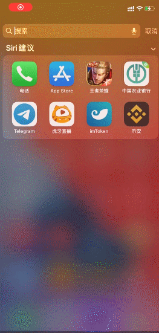

# 苹果stash（Clash）

###  Stash

### 下载软件


注意：Stash需要您的手机系统为IOS13以上


Stash售价3美元且只能在国外App Store进行下载，所以要切换国外ID将商店切换到国外，这边提供了美区ID进行免费下载。


注意：请登陆App Store，不要登陆网页和icloud否则登陆助手内无法收到登陆验证码



登陆后提示设备验证码，请按照下方步骤操作。注意：如果直接显示【一条包含验证码的信息发送至(\*\*\*)\*\*\*\*\*\*xx】直接看第3步，

1. 如果如下图显示，请选择下方【没有收到验证码？】

2\. 选择【发送验证码至(\*\*\*)\*\*\*\*\*\*xx】


3\. 然后在打开登陆助手[https://id.abcabc.cyou/](https://id.abcabc.cyou/)

4\. 查看相应账号的最新时间的验证码

.png>)


### 1.美区苹果ID账号密码



#### Apple ID账号

```
w1akr14eknx04@163.com
```

#### Apple ID 密码

```
Dd667788
```



#### Apple ID账号

```
```

#### Apple ID密码

```
```



### 2. AppleID登录教程

IOS14以上和IOS13以下版本登录商店位置不同，请参考图片



#### **IOS** 位置

1.打开应用商店后点击右上角的头像,翻到最下方点退出





### 3. 软件下载

成功登录后，重新打开App Store商店。然后搜索stash下载（如图）

.jpeg>)

### 使用教程

### 1. 软件主界面

.png>)

### 2. 导入订阅（分为一键导入和手动导入）



2.1.1 打开Safari浏览器输入官网地址：[netv2.top](https://netv2.top/) 点击一键订阅，导入到Stash。


注意：请使用Safari浏览器，不要在QQ内，微信内，百度内打开否则无法跳转，






2.2.1 打开浏览器输入官网地址：[https://netv2.top](https://netv2.top) 登录后点击一键订阅，复制订阅地址


2.2.2 按照图示





### 3. 连接启动

导入后，点击<mark style="color:blue;">**启动**</mark>，没有特殊需求可以使用第一个自动选择，<mark style="color:blue;">**第一次运行会弹出窗口，点击允许就可以了**</mark>


### 4. 连接测试

连接后，可以打开[www.YouTube.com](https://youtube.com/)测试一下，如果油管可以打开就说明已经成功

### 5. 更新订阅（Stash支持自动更新）



#### 如图





### 6.选择模式

选择模式如果需要选择模式，请在主界面点击 （全局路由）


<mark style="color:red;">注意：全局模式下不要用DIRECT和REJECT，请选择显示地区的节点</mark>


.png>)

> 规则：代表规则模式，属于国内直连，国外自动走节点流量（建议使用）
>
> 全局：代表全局模式，全部国内国外都走节点流量（有可能导致访问国内比较卡）
>
> 直连：代表直连模式，全部国内国外走不走节点流量（相当于没开小火箭）
