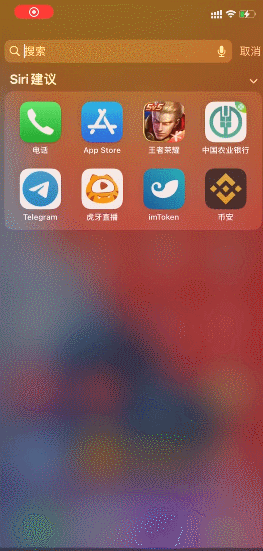
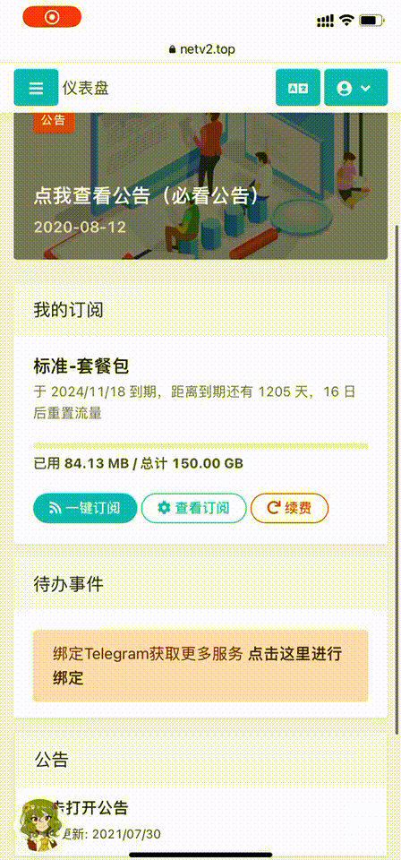
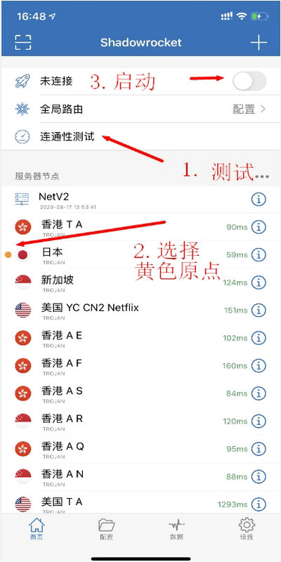
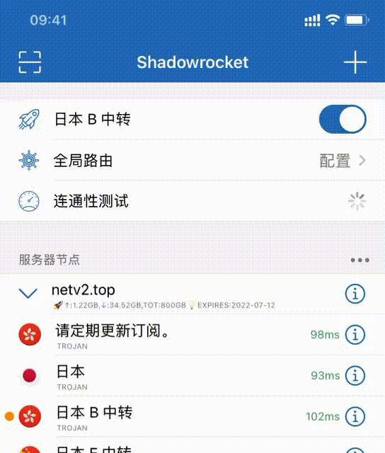
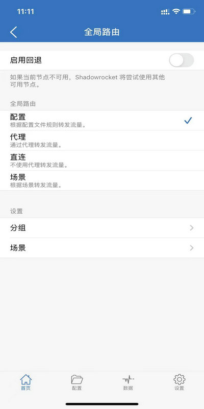

# 苹果Shadowrocket小火箭图文教程

### 下载软件

Shadowrocket（俗称小火箭）售价3美元且只能在国外App Store进行下载，所以要切换国外ID将商店切换到国外，这边提供了美区ID进行免费下载。

### 1.美区苹果ID账号密码


如果提示输入密保，说明你选错了，返回上一步选其它选项，点不升级（按照下方教程登录）

如果提示输入验证码，代表这个账号已经不能用了，使用其他账号或者联系客服更换




#### Apple ID账号（登录时会提示升级账户安全，请选择<mark style="color:red;">**其他选项**</mark>，然后<mark style="color:red;">**不升级**</mark>）

```
w1ahnru147ehknux@163.com
```

#### Apple ID 密码（登录时会提示升级账户安全，请选择<mark style="color:red;">**其他选项**</mark>，然后<mark style="color:red;">**不升级**</mark>）

```
Dd6677889
```



#### Apple ID账号（登录时会提示升级账户安全，请选择<mark style="color:red;">**其他选项**</mark>，然后<mark style="color:red;">**不升级**</mark>）

```
w1aeknru047aehn@163.com
```

#### Apple ID 密码（登录时会提示升级账户安全，请选择<mark style="color:red;">**其他选项**</mark>，然后<mark style="color:red;">**不升级**</mark>）

```
Qwe33557799
```



### 2. AppleID登录教程

IOS14以上和IOS13以下版本登录商店位置不同，请参考图片



#### **IOS 14/15**位置

1.打开应用商店后点击右上角的头像,翻到最下方点退出



2.登录时会提示升级账户安全，请选择<mark style="color:red;">**其他选项**</mark>，然后<mark style="color:red;">**不升级**</mark>

.gif>)



#### IOS 13和以往版本位置

点击设置→往下翻到隐私下面点击iTunes与App Store→然后退出你的ID→登录上面提供的美区ID





### 3. 软件下载

成功登录后，重新打开App Store商店。然后搜索shadowrocket下载（如图）


### 使用教程

### 1. 软件主界面


### 2. 导入订阅（分为一键导入和手动导入）



2.1.1 打开Safari浏览器输入官网地址：[netv2.top](https://netv2.top) 点击一键订阅，导入到shadowrocket。


注意：请使用Safari浏览器，不要在QQ内，微信内，百度内打开否则无法跳转，


###



2.1.2 导入后会自动跳转到小火箭shadowrocket内（注意：导入时，请保证右上角的连接按钮是关闭状态，如果导入后没显示地区节点，请后台强行关闭软件后重新打开软件就会显示了）





2.2.1 打开浏览器输入官网地址：[https://netv2.top](https://netv2.top) 登录后点击一键订阅，复制订阅地址


2.2.2 然后打开小火箭右上角的加号（注意：导入时，请保证右上角的连接按钮是关闭状态，如果导入后没显示地区节点，请后台强行关闭软件后重新打开软件就会显示了）


2.2.3 类型选择Subscribe，把订阅链接粘贴到URL里面，点击完成即可





### 3. 连接启动

导入后，点击测试连通性，选择一个有效的（未超时）地区节点，然后点击右上角的连接按钮，<mark style="color:blue;">**第一次运行会弹出窗口，点击允许就可以了**</mark>




### 4. 连接测试

连接后，可以打开[www.YouTube.com](https://youtube.com)测试一下，如果油管可以打开就说明已经成功

### 5. 更新订阅（更新时请，建议关闭小火箭启动按钮）



### 主界面，滑动标签，点击更新。





### &#x20;设置自动更新订阅，点击设置，翻到最下面，点击订阅，里面可以把自动更新打开，但是平时还是建议定期手动更新下更稳妥。





### 6.选择模式

选择模式如果需要选择模式，请在主界面点击 （全局路由）



> 配置：代表规则模式，属于国内直连，国外自动走节点流量（建议使用）
>
> 代理：代表全局模式，全部国内国外都走节点流量（有可能导致访问国内比较卡）
>
> 直连：代表直连模式，全部国内国外走不走节点流量（相当于没开小火箭）
>
> 场景：配置比较复杂不建议用。
