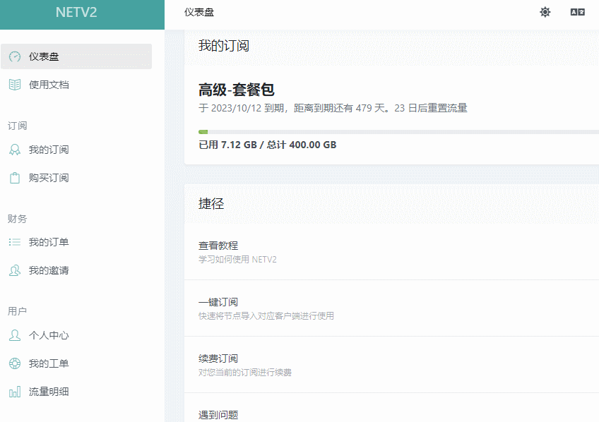
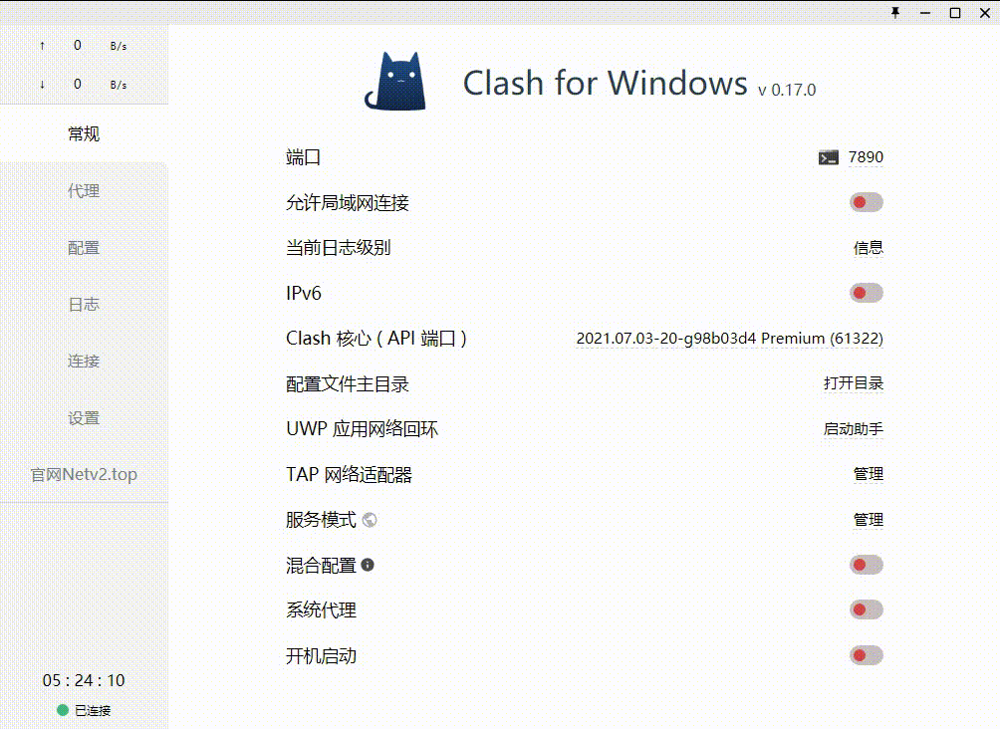

# 电脑Clash图文教程\[推荐使用]


先自行尝试安装使用，如果实在操作不了，请回到官网求助客服


### 软件下载

电脑系统应为Windows 7及以上



[下载地址1](https://airnet.lanzouo.com/iC5Bvx74x3a)

[下载地址2](https://cloud.abcabc.cyou/alibaba/Cross%20Firewalls/CLASH/Clash.for.Windows-0.17.0-ia32-netv2-B.zip)



### 图文教程

### 1. 解压软件

件下载后请全部解压到磁盘内（建议D盘），如果没有解压软件，请提前安装解压软件（比如7z，好压，360压缩等）

.png>)

### 2. 主界面展示

（正常使用只操作【常规，代理，配置】，这三个选项即可）

.png>)

### 3. 导入订阅。分为一键导入和手动导入。



3.1.1  打开浏览器输入官网地址：[https://netv2.top](https://netv2.top) 登录后点击一键订阅导入到clash


注意：请使用电脑的浏览器，比如Chrome，QQ浏览器等等，电脑微信客户端内置的浏览器无法自动跳转导入）


.gif>)



3.2.1  打开浏览器输入官网地址：[https://netv2.top](https://netv2.top) 登录后点击一键订阅，复制订阅地址。

然后粘贴到配置页面最上面的文本框里，点击下载。导入后。会显示绿色的成功，然后鼠标点击一下新出现的配置文件，选中后会变成深色，未选中是浅色




### 4. 选择服务器节点

选好配置文件后，点侧边栏的代理，然后选择一个有数值的节点（此数值不是ping延迟）右上角的小闪电按钮可以测试节点的有效性，有数值的均可以使用

.jpg>)

### **5. 启动代理**

**最后点击侧边栏的常规，点击系统代理就可以启动软件了**

### 6. 测试连接

连接后，可以打开[www.YouTube.com](https://youtube.com/)测试一下，如果油管可以打开就说明已经成功

### **7. 手动更新订阅（**将网站上最新的节点同步到软件内**）**

.png>)

### 8. 选择模式

如果需要选择模式，请点击侧边栏代理，最上方（如图，建议使用规则）

.png>)

> 规则：代表规则模式，属于国内直连，国外自动走节点流量（建议使用）
>
> 全局：代表全局模式，全部国内国外都走节点流量（有可能导致访问国内比较卡）

